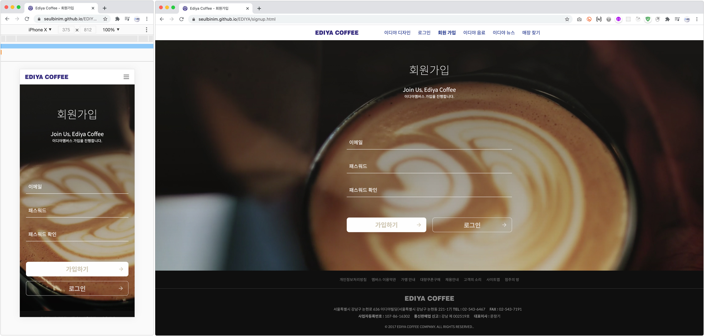
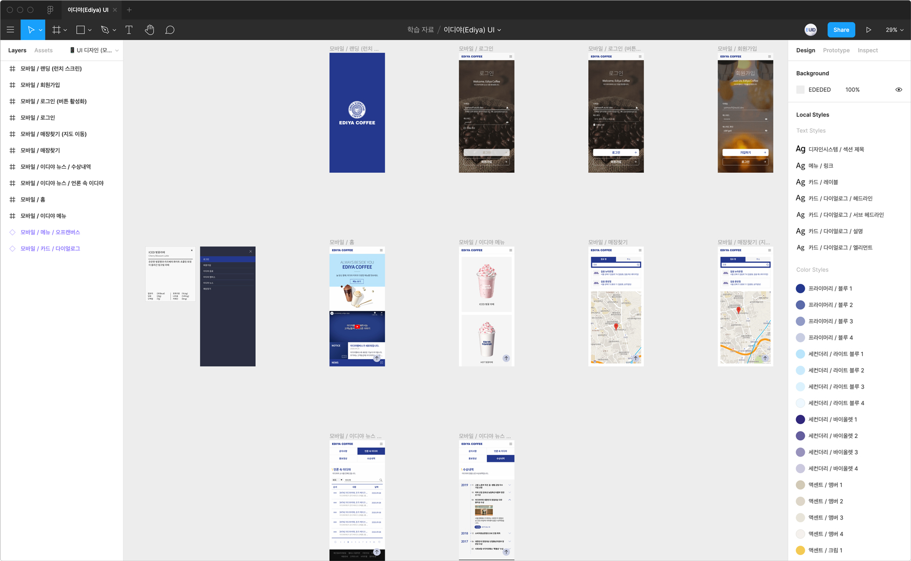
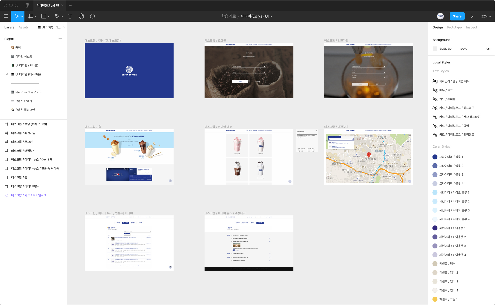
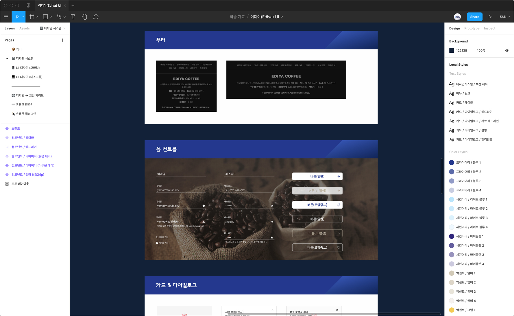
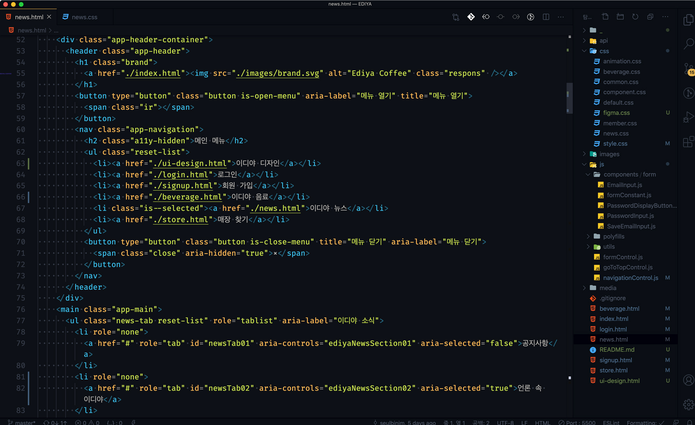
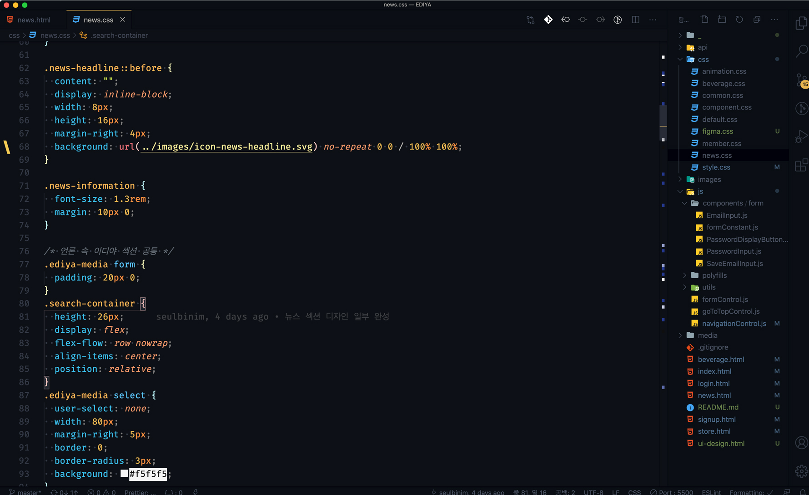
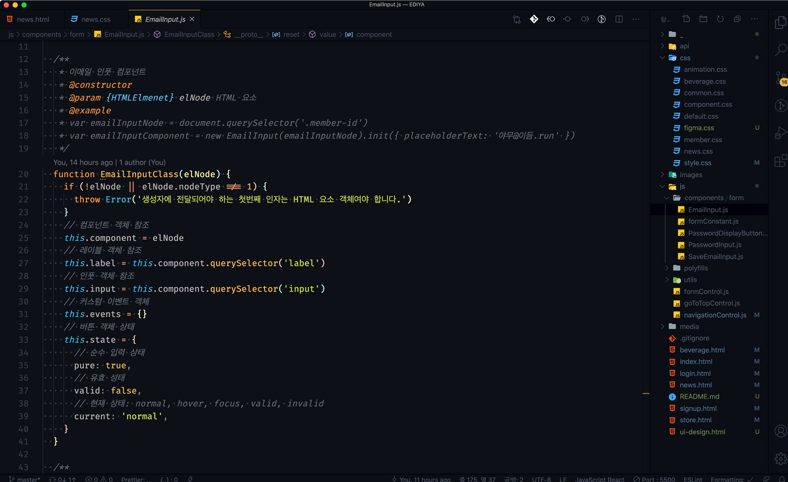
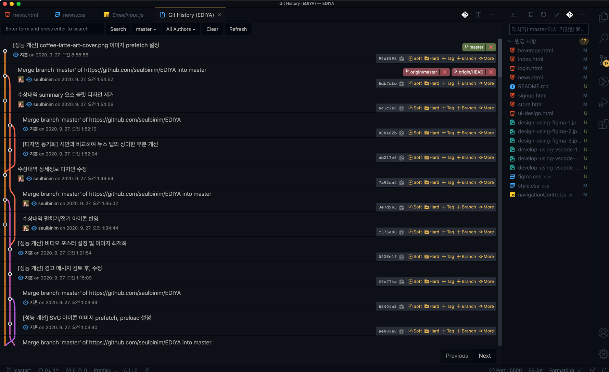

# 이디야 커피 UI 디자인 & 개발

**[이듬(E.UID)](https://euid.dev) 블렌디드 러닝, 학습용(디자인 → 개발)** 으로 제작된 [이디야 커피 브랜드 사이트](https://seulbinim.github.io/EDIYA/ui-design.html)입니다.

 

## UI 디자인

**Designer** — UI 개발 학습에 필요한 구성 요소 중심으로 모바일/데스크탑 UI를 디자인합니다.

- UI 디자인에 최적화 된 Figma 도구 활용
- 디자인 시스템 (컴포넌트, 상태 디자인 등)
- 프로토타입 (개발에 요구되는 사항을 시뮬레이션)
- 모바일 UI ( 0 — 767px )
- 데스크탑 UI ( 768px+ )

> Mobile UI

> Desktop UI

> Design System

 

## UI 개발

**Developer** — 제작된 UI 디자인을 토대로 모바일/데스크탑 UI를 개발합니다.

- 코딩에 적합한 Visual Studio Code 도구 활용
- 모두를 위한 디지인 (Universal Design, A11Y)
- 의미있는 구조 설계 (HTML5 + WAI-ARIA)
- 반응형 웹 스타일링 (CSS3, RWD)
- 인터랙션 프로그래밍 (OOJS + DOM Script)
- 소스 버전 관리 (Git)
- 팀 컬래버레이션 (GitHub)

> Semantic Markup (HTML5 + WAI-ARIA)

> Responsive Styling (CSS3 + RWD)

> Interaction Design (Reusable Components)

> Version Control System (Git + GitHub)

